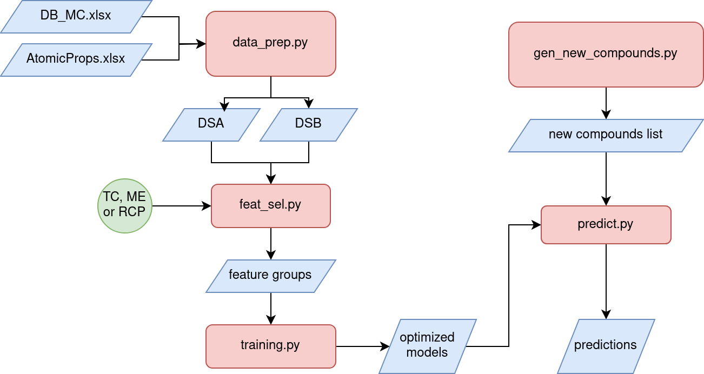

# MCML

 This repository cotains all the Scripts and data used in the article entitled "Machine Learning Methodologies applied to Magnetocaloric Perovskites Discovery", recently submitted to the Journal of Chemical information and Modeling and currently under revision. 
Manuscript ID: ci-2024-01944t
Author(s): Castro Anaya, Luis; Marese, Eduardo; Lozano, Jaime ; Peixer, Guilherme; Barbosa Jr., Jader; GOMEZ GONZALEZ, SERGIO YESID

## Graphical README

